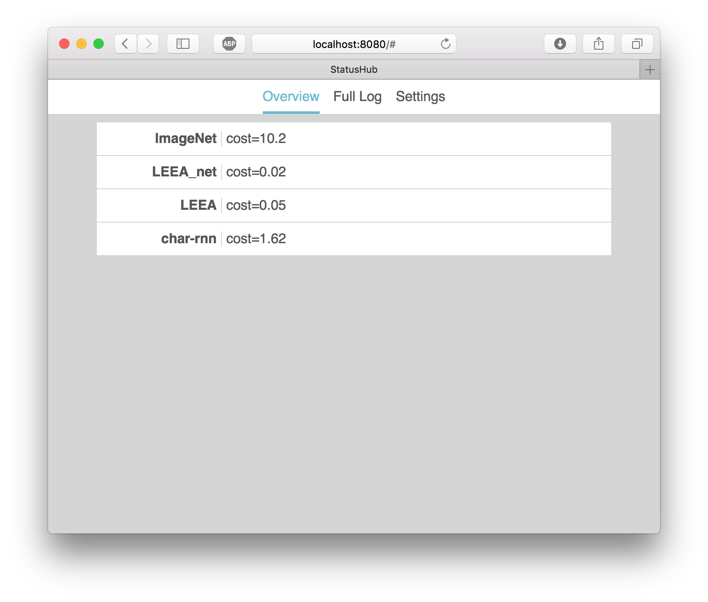

# StatusHub

StatusHub is a system for pushing and viewing log messages in a unified place. It is designed to unify the outputs of numerous long-running scripts in one place.

For example, I train a lot of neural networks on various machines. Every minute or so, these networks compute a numerical "cost" indicating how well they are doing. With StatusHub, I can check on these networks from anywhere using the StatusHub web UI.



# Usage

First, you must have [Go installed and configured](https://golang.org/doc/install). You should also have `$GOPATH/bin` added to your shell's path.

To download StatusHub with Go, do the following:

```
$ go get -u github.com/unixpickle/statushub/...
```

Now, you can run a StatusHub server like so:

```
$ sh-server -port=8080
```

You can replace the port with whatever you like. By default, the configuration will be saved to the current directory in a file named `config.json`. To change the configuration filename, use `-config filename.json`. If you decide to put StatusHub behind a reverse proxy, it is recommended that you add `-proxies=1` to tell the rate limiter to use the `X-Forwarded-` headers.

You can now view the StatusHub web UI in a browser. If you used the exact command above, the URL `http://localhost:8080` will work. At first, you will be prompted for a password. Once you have entered one, you are ready to view your logs.

To send the output of a command to StatusHub, you can use the `sh-log` command as follows:

```
$ export STATUSHUB_HOST=http://localhost:8080
$ my_command 2>&1 | sh-log ServiceName
```

Optionally, you can set the `STATUSHUB_PASS` environment variable to avoid having to enter the StatusHub password every time you run `sh-log`. Note the `2>&1`, which pipes the command's standard error to standard output. Without this, only the standard output will be logged.

# Development

To develop the `sh-server` command, you will need the following:

 * [Node.js](https://nodejs.org)
 * [Go](https://golang.org/doc/install)
 * [go-bindata-assetfs](https://github.com/elazarl/go-bindata-assetfs)
 * Bash

When you have edited an asset for `sh-server` such as a stylesheet or a script file, you must re-build the assets by running [sh-server/build.sh](sh-server/build.sh).

# TODO

 * Persist the log to a file
 * Android Wear application
 * Use a grid layout for the "Overview" page
 * Display log message dates
