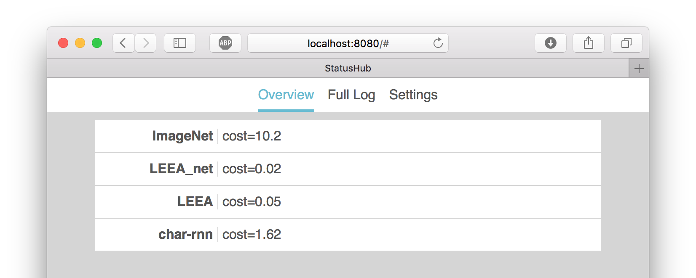

# StatusHub

StatusHub is designed to unify the outputs of numerous long-running scripts in one place.

For example, I train a lot of neural networks on various machines. Every minute or so, these networks compute a numerical "cost" indicating how well they are doing. With StatusHub, I can check on these networks from anywhere using the StatusHub web UI.



# Usage

First, you must have [Go installed and configured](https://golang.org/doc/install). You should also have `$GOPATH/bin` added to your shell's path.

To download StatusHub, do the following:

```
$ go get -u github.com/unixpickle/statushub/...
```

Now you can run a StatusHub server like so:

```
$ sh-server -port=8080
```

You can replace the port with whatever you like. By default, the configuration will be saved to the current directory in a file named `config.json`. To change the configuration filename, use `-config filename.json`. If you decide to put StatusHub behind a reverse proxy, it is recommended that you add `-proxies=1` to tell the rate limiter to use the `X-Forwarded-` headers.

You can now view the StatusHub web UI in a browser. If you used the exact command above, the URL `http://localhost:8080` will work. At first, you will be prompted for a password. Once you have entered one, you are ready to view your logs.

You can use the `sh-log` command to post log messages. First, setup your environment. The `STATUSHUB_PASS` variable is optional, but it saves you from having to type the password every time you run `sh-log`.

```
$ export STATUSHUB_ROOT=http://localhost:8080
$ export STATUSHUB_PASS=myPassword
```

By default, `sh-log` logs its standard input, where each line is treated as a different message. The only argument is the service name, which you can set to be anything you like:

```
$ sh-log "Service Name"
Line one is a message.
Message 2
^D
```

To send the output of a command to StatusHub, you could theoretically use a UNIX pipe. However, it is much simpler to pass the command arguments to `sh-log` as follows in this example:

```
$ sh-log "Service Name" ping google.com
```

If you still want to use a UNIX pipe, be aware of the following things. First, pipes are buffered, so lines may not be logged right away. Second, you have to make sure that standard error gets sent through the pipe. Third, interrupts like the one caused by `Ctrl+C` are sent to the entire pipeline, which may prevent your command from doing a graceful shutdown since `sh-log` may die first.

# Development

To develop the `sh-server` command, you will need the following:

 * [Node.js](https://nodejs.org) and NPM (the package manager for Node)
 * [Go](https://golang.org/doc/install)
 * [go-bindata-assetfs](https://github.com/elazarl/go-bindata-assetfs)
   * `go install github.com/elazarl/go-bindata-assetfs/...@v1.0.1`
 * Bash

When you have edited an asset for `sh-server` such as a stylesheet or a script file, you must re-build the assets by running [sh-server/build.sh](sh-server/build.sh).

# TODO

 * Finish Go client
 * Persist the log to a file
 * More informative URLs in Web UI (e.g. '/service/NameHere')
